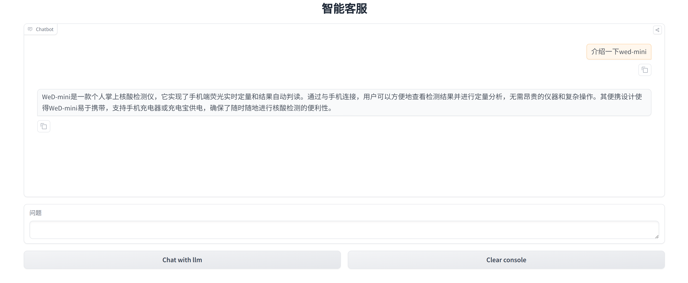

# 基于langgraph与大模型的分子诊断设备智能客服

## 一、项目介绍

### 1、项目背景介绍

自OpenAI发布GPT-3.5以来，大语言模型（LLMs）被迅速被应用到了各个领域当中，利用LLMs构建AI agent是当前热门的研究方向，例如可以使用LLMs擅长生成连贯且符合上下文的文本的能力，构建智能客服，聊天机器人等agent应用。但是，LLMs生成的内容主要基于训练数据和模型的内在知识，而这些信息可能并不总是准确或最新的，为了使大语言模型能够更加准确的回答特定问题，需要引入RAG技术。RAG 是一种将信息检索与生成式模型相结合的技术，通过在生成过程中引入外部知识库或文档库的相关信息来增强文本生成，可以集成在AI Agent中来提高其在这些任务上的表现。


项目参考了论文,利用langGraph构建了CRAG，并进行了一定的改进，主要改动如下：1、用户问题重写后进行搜索。2、使用在大语言模型。3、决策边下游从三类简化为两类

本项目是基于某公司开发的一款新型的分子诊断设备的说明书，客服问答记录，，由于市面上同类设备较少，使用者大多是初次使用，因此对在使用设备时会遇到许多问题，为了帮助使用者迅速解决在使用过程中遇到的问题，利用RAG开发了这一款智能客服系统。


### 2、项目展示
本项目通过现有的设备相关文档，包括但不限于说明书，客服聊天记录等，搭建起了一个专属知识库，使客户可以快速获得所需的答案。

项目界面



## 二 技术实现

### 1、安装环境依赖
```
gradio
langchain==0.2.10
transformers==4.42.4 
langchain-community==0.2.9                    
langchain-core==0.2.22                   
langchain-text-splitters==0.2.2
chromad==0.5.4 
langgraph == 0.1.19
```

### 2、项目运行
```
修改serve.run_gradio.py, 添加 api-key
使用 python run_serve.py 运行该文件
```

### 3、项目修改
```
将knowledge_db下的pdf文件更换为其他pdf文件，即可打造专属的知识问答系统
```


### 重要模块介绍
```
 performance_testing.ragas_evaluate 使用ragas对RAG系统性能进行测试
 serve.run_gradio.py ，运行程序
 graph.crag.py ，使用langgraph构建的crag

```